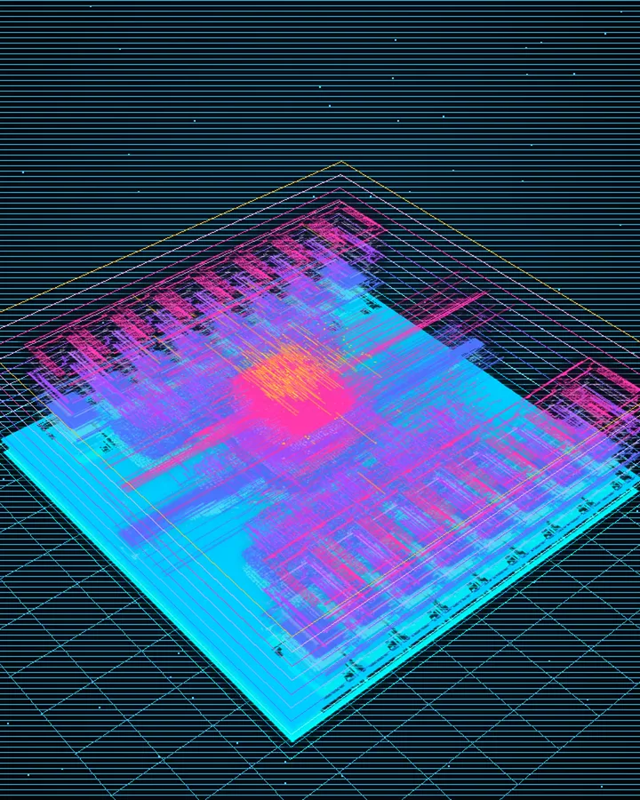
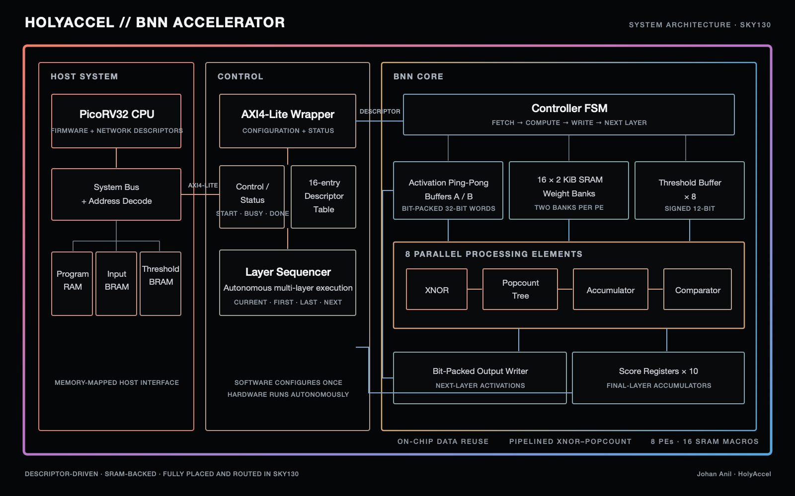
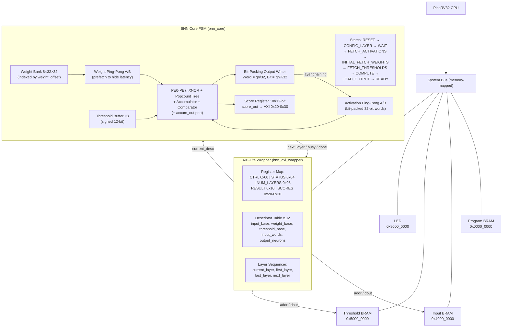

<div align="center">

# RISC-V Binary Neural Network (BNN) Accelerator

### Descriptor-Based AI Accelerator in SystemVerilog

*A configurable Binary Neural Network inference accelerator integrated with a PicoRV32 RISC-V processor through an AXI4-Lite interface, with a trained MNIST digit recognition demo.*


</div>

---

# Overview

This project implements a **software-programmable Binary Neural Network (BNN) accelerator** built completely in **SystemVerilog RTL**.

Unlike fixed-function AI accelerators, this design follows a **descriptor-based execution model**, where the RISC-V processor programs an entire neural network before execution begins. The accelerator then executes each layer autonomously without requiring CPU intervention between layers.

The design is verified end-to-end: a PyTorch-trained BNN (using straight-through estimator + teacher distillation) is exported to a hardware-exact hex format, loaded into the RTL via `$readmemh`, and run through a Cocotb testbench that compares the silicon behavior bit-for-bit against a Python golden model.

The long-term objective is to evolve this project from a Binary Neural Network accelerator into a scalable low-precision AI accelerator supporting INT8, INT4 and convolutional workloads.

---

# SKY130 ASIC Physical Implementation

The `asic-sky130` branch extends the verified RTL into an experimental **RTL-to-GDS physical-design flow** using Yosys, OpenROAD, KLayout, the SkyWater SKY130 HD standard-cell library, and 16 hard SRAM macros.

[](docs/assets/bnn_core_gds_layer_orbit.mp4)

The completed OpenROAD run produced:

- 65,423 placed standard-cell instances
- 16 × 2 KiB Sky130 SRAM macros arranged in two columns
- 37.6% post-CTS placement utilization
- 7,382,423 µm of routed wire and 668,771 vias
- 0 remaining OpenROAD detailed-router violations

The animation above is reconstructed from the actual LI1–M5 and via geometry in the generated GDS. The flow sources, constraints, reports, signoff experiments, and visualization pipeline are documented in [`asic/`](asic/) and [`visualization/`](visualization/).

> **Signoff status:** OpenROAD detailed routing completed with zero internal router violations. Representative external KLayout BEOL/OFFGRID regions were checked, but full-chip foundry-qualified DRC and LVS have not completed. This branch is a physical-design learning result, not a tapeout-ready signoff claim.

---

# Project Goals

- Build a configurable Binary Neural Network accelerator
- Integrate with a custom PicoRV32 SoC
- Design a reusable descriptor-based execution engine
- Learn production-style RTL design methodology
- Develop a modular architecture that can evolve toward FPGA and ASIC implementations
- Demonstrate a complete end-to-end AI pipeline: training → export → RTL → verification

---

# System Architecture



The diagram above is available as an editable vector in [`docs/holyaccel_architecture.svg`](docs/holyaccel_architecture.svg).

## High-Level SoC Topology

```
                         PicoRV32 CPU
                              │
                      Wishbone / Memory Bus
                              │
          ┌───────────────────┴────────────────────┐
          │                                        │
          ▼                                        ▼
 Instruction / Data RAM                     BNN AXI Wrapper
                                                    │
        ┌───────────────────────────────────────────┴────────────────────────┐
        │                                                                    │
        │  Control Registers                                                 │
        │      • CTRL (start)                                                │
        │      • STATUS (busy/done)                                          │
        │      • NUM_LAYERS                                                  │
        │      • SCORES (final-layer accumulators)                           │
        │                                                                    │
        │  Descriptor Memory                                                 │
        │      • Layer 0 .. Layer 15                                         │
        └──────────────────────────────────┬─────────────────────────────────┘
                                           │
                                     current_desc
                                           │
                                           ▼
                                      BNN Core FSM
```

## Detailed Core Architecture



---

# Execution Flow

Unlike traditional software-controlled accelerators, the CPU configures the complete neural network before inference starts.

```
Firmware
   │
   ▼
Generate Layer Descriptors (from network.json)
   │
   ▼
Write Descriptor Table through AXI4-Lite
   │
   ▼
Write NUM_LAYERS register
   │
   ▼
Assert START bit in CTRL register
   │
   ▼
Layer 0 → Layer 1 → Layer 2 → ... → DONE
```

Once started, the hardware executes every layer autonomously. The firmware only polls the STATUS register for the `done` bit, then reads the ten 12-bit score registers and picks the argmax to decode the predicted digit.

---

# AXI Register Map

The accelerator is memory-mapped at `0x3000_0000` in the SoC address space.

| Offset | Register | Access | Description |
|---|---|---|---|
| `0x00` | CTRL | R/W | bit0 = START (self-clearing after one cycle) |
| `0x04` | STATUS | R | bit0 = busy, bit1 = done |
| `0x08` | NUM_LAYERS | R/W | number of layers to sequence (1..16) |
| `0x10` | RESULT | R | (reserved for future use) |
| `0x20` | SCORES[0] | R | digits 1,0 — two 12-bit signed accumulators packed in one 32-bit word |
| `0x24` | SCORES[1] | R | digits 3,2 |
| `0x28` | SCORES[2] | R | digits 5,4 |
| `0x2C` | SCORES[3] | R | digits 7,6 |
| `0x30` | SCORES[4] | R | digits 9,8 |
| `0x100 + i·32 + 0` | DESC[i].input_base | R/W | byte address in inp_bram |
| `0x100 + i·32 + 4` | DESC[i].weight_base | R/W | slot offset in the weight bank (bits `[4:0]` used) |
| `0x100 + i·32 + 8` | DESC[i].threshold_base | R/W | byte address in th_bram |
| `0x100 + i·32 + 12` | DESC[i].input_words | R/W | number of 32-bit activation words to fetch |
| `0x100 + i·32 + 16` | DESC[i].output_neurons | R/W | number of neurons in layer i |

The **SCORES** registers carry the raw accumulator values from the final layer. The firmware decodes the digit by picking the index of the maximum score (argmax), which is equivalent to ranking by the true ±1 dot product and avoids the ~50% accuracy penalty of decoding from binarized flags.

---

# Descriptor-Based Architecture

Each neural network layer is represented by a descriptor containing all information required for execution.

```
Layer Descriptor (layer_desc_t, 144 bits)

+---------------------------+
| Input Base Address  [32]  |
+---------------------------+
| Weight Base Address [32]  |   ← only bits [4:0] used as slot offset
+---------------------------+
| Threshold Base Address [32]|
+---------------------------+
| Number of Input Words [16]|
+---------------------------+
| Number of Output Neurons [16]|
+---------------------------+
```

The AXI wrapper stores up to 16 descriptors. The BNN core requests one descriptor at a time using its `current_layer` index. This keeps the execution engine completely independent from software configuration.

---

# Processing Element Datapath

Each PE implements the core BNN computation:

```
M = Σ popcount(XNOR(activation_word, weight_word))
output_bit = (M > threshold) ? 1 : 0
```

The popcount is computed through a fully combinational 5-stage Wallace-style adder tree:

```
32 bits XNOR result
       ↓
Stage 1: 16 × 2-bit sums
       ↓
Stage 2: 8 × 3-bit sums
       ↓
Stage 3: 4 × 4-bit sums
       ↓
Stage 4: 2 × 5-bit sums
       ↓
Stage 5: 1 × 6-bit sum_reg → added to accumulator
```

A second output port `accum_out` exposes the raw accumulator value for the final layer, enabling score-based decoding on the CPU side.

---

# Ping-Pong Buffering

Both activations and weights use **double buffering** (ping-pong banks A and B):

- While the PEs compute on bank A, the FSM prefetches the next batch into bank B.
- At the end of each compute phase, the banks swap in a single clock cycle.

This hides memory latency and keeps the PEs fed every cycle during the COMPUTE state.

---

# Bit-Packing Output Writer

The `LOAD_OUTPUT` state writes each PE's output bit into the activation ping-pong buffer using efficient bit-math (no hardware dividers):

```systemverilog
gn = neuron_counter + k;                          // global neuron ID
activation_buffer[gn >> 5][gn[4:0]] <= pe_bit[k]; // Word = gn/32, Bit = gn%32
```

This produces the next layer's input activations directly, enabling layer chaining with no CPU involvement.

---

# Network Configuration

The reference trained network is:

| Layer | Input | Output | Input Words | Weight Slots |
|---|---|---|---|---|
| 0 | 784 (28×28 pixels) | 144 | 25 | 18 (144/8) |
| 1 | 144 | 96 | 5 | 12 (96/8) |
| 2 | 96 | 10 | 3 | 2 (10/8) |
| **Total** | | **10 digits** | | **32 slots** |

The network exactly fills the 32-slot weight bank. Achieved accuracy on MNIST test set:

- Float reference model: ~89.5%
- Hardware-exact score readout: **~89.6%** (bit-for-bit match with silicon)

The network is trained with a float teacher (~97% accuracy) providing soft labels via distillation, then binarized using the straight-through estimator (STE).

---

# Hardware Modules

## PicoRV32

Acts as the host processor responsible for:

- Configuring the accelerator
- Programming descriptor memory
- Starting inference
- Monitoring completion
- Decoding the predicted digit from score registers

## AXI4-Lite Wrapper

The wrapper provides the software-visible interface. Responsibilities include:

- AXI4-Lite slave interface
- Control and status registers
- Descriptor storage and lookup
- Packing of final-layer score registers
- Interface between firmware and execution engine

The wrapper **does not perform neural network computation**.

## BNN Core

The BNN Core is the execution engine. Responsibilities include:

- Fetching layer descriptors
- Configuring execution registers
- Scheduling processing elements
- Address generation for BRAM reads
- Ping-pong buffer management
- Layer sequencing (first/last layer detection)
- Multi-layer autonomous execution

## Processing Elements

Each PE performs BNN computations using XNOR-Popcount operations. Eight PEs execute in parallel, processing eight neurons per cycle. Each PE also exposes its accumulator for the final-layer score register.

---

# Repository Structure

```
.
├── rtl/
│   ├── top_soc.sv                  # Top-level SoC with PicoRV32 + bus decode
│   ├── bnn_core.sv                 # FSM + ping-pong + bit-packing + score reg
│   ├── bnn_axi_wrapper.sv          # AXI-Lite slave + descriptor table
│   ├── core_processing.sv          # PE: XNOR + popcount + accumulator
│   ├── constants_pkg.sv            # Global parameters
│   ├── fsm_pkg.sv                  # FSM state enum
│   └── layer_pkg.sv                # Layer descriptor struct
│
├── verification/
│   ├── utils.py                    # Clock, reset, debug helpers
│   ├── test_axi_seq.py             # Multi-layer AXI sequencing test
│   └── test_network_6layer.py      # Full MNIST network test + golden model
│
├── training/
│   └── train_bnn.py                # PyTorch trainer + export + emulator
│
├── firmware/
│   └── (C firmware for PicoRV32)
│
├── sim_build/                      # Verilator build artifacts
├── Makefile                        # Simulation and build targets
└── README.md
```

---

# Current Features

- ✅ PicoRV32 host processor with memory-mapped decode
- ✅ SystemVerilog RTL design
- ✅ AXI4-Lite slave accelerator interface
- ✅ Descriptor-based layer scheduling (16 layers max)
- ✅ Multi-layer autonomous execution
- ✅ 8× parallel processing elements
- ✅ XNOR + 5-stage combinational popcount tree
- ✅ Ping-pong (double) buffering for activations and weights
- ✅ Bit-packed activation writer (Word = gn/32, Bit = gn%32)
- ✅ Final-layer score register with AXI readout
- ✅ Cocotb + Python verification with bit-exact golden model
- ✅ Verilator simulation with VCD trace
- ✅ PyTorch training pipeline with teacher distillation
- ✅ Hardware-exact export to `$readmemh` hex files
- ✅ MNIST demo: 784→144→96→10 network at ~89.6% score-readout accuracy

---

# Design Philosophy

This project follows a modular hardware architecture inspired by modern AI accelerators (TPU v1, Eyeriss, FINN).

The design separates software configuration from hardware execution:

- **Firmware** describes the neural network via descriptors.
- **AXI wrapper** stores configuration data.
- **BNN core** performs sequencing and execution.
- **Processing elements** perform computation.

This separation allows future architectural improvements (INT8, convolutions, DMA) without redesigning the execution engine.

---

# Verification

Current verification flow:

```
PyTorch Training
        ↓
Export to Hex (weight_bank.hex, th_bram.hex, inp_bram.hex)
        ↓
RTL + Verilator
        ↓
Cocotb Testbench
        ↓
Python Golden Model (bit-exact)
        ↓
Waveform Analysis (VCD)
```

Three layers of confidence:

1. **Reference model accuracy** (float ranking) — upper bound
2. **Hardware-exact emulator** (reads only exported hex) — proves the export is faithful
3. **Cocotb RTL simulation** (golden model comparison) — proves the silicon matches

Each module is verified independently before integration.

---

# Future Roadmap

### Near-Term

- ✅ Descriptor memory implementation
- ✅ AXI register map with score readout
- Interrupt support (done signal → CPU IRQ)
- Performance benchmarking (cycles/inference, BOPs, utilization)
- FPGA deployment on a development board

### Medium-Term

- DMA engine for weight loading from external memory
- ✅ Double buffering (already implemented)
- AXI Master interface for autonomous memory access
- INT8 inference support
- INT4 inference support
- Convolution support (im2col + Winograd)

### Long-Term

- ✅ PyTorch model trainer (with distillation)
- ✅ Automated descriptor generation (network.json)
- FPGA optimization (timing closure, BRAM inference)
- ASIC-oriented implementation
- Physical design exploration using the SkyWater SKY130 PDK with OpenLane/OpenROAD
- Evaluate a reduced configuration suitable for TinyTapeout
- Replace flip-flop weight bank with ROM macro for silicon

---

# Learning Objectives

This project is primarily intended as an exploration of modern computer architecture and AI hardware design.

Topics explored include:

- Computer Architecture
- RTL Design (SystemVerilog)
- AXI4-Lite protocol
- Hardware/Software Co-design
- Binary Neural Networks + STE training
- Memory hierarchy (ping-pong buffering)
- FPGA Design (Vivado)
- Verification Methodologies (Cocotb, golden models)
- RISC-V SoC Design (PicoRV32 integration)

---

# References

- [PicoRV32](https://github.com/YosysHQ/picorv32) — RISC-V CPU core
- RISC-V ISA Specification
- [Google TPU v1](https://arxiv.org/abs/1704.04760) — In-Datacenter Performance Analysis of a TPU
- [Eyeriss](https://eyeriss.mit.edu/) — Energy-Efficient Deep Neural Network Accelerator
- [FINN](https://github.com/Xilinx/finn) — Framework for fast, scalable quantized NN inference
- [BinaryConnect (Courbariaux et al., 2015)](https://arxiv.org/abs/1511.00363) — Training DNNs with binary weights
- [BNN (Courbariaux et al., 2016)](https://arxiv.org/abs/1602.02830) — Binarized Neural Networks
- AXI4-Lite Specification (ARM IHI 0033C)

---

## License

MIT License

---

<div align="center">

**Built using SystemVerilog • PicoRV32 • Cocotb • Verilator • PyTorch**

</div>
